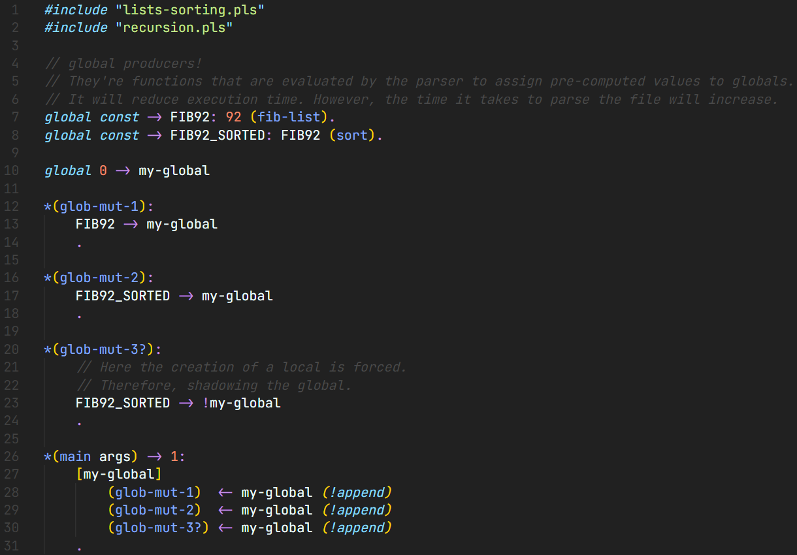

# Pulsar Language Extension

Adds Pulsar Language support for VSCode.

As of now only syntax highlighting is supported.

## What's Pulsar?

Pulsar is a *stack-based* *dynamically-typed* *interpreted* scripting language written in C++.

It's open source on GitHub at [Marco4413/Pulsar](https://github.com/Marco4413/Pulsar).

## Screenshots

